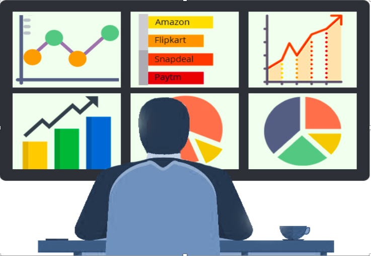

# Implementing Customer Segmentation to Predict CLV, Churn, and Next Day Purchase 

**Note**: 
- This project is a work in progress. There are more notebooks to come! 
- These notebooks represent combinations of programming, data analysis, and machine learning adapted by Baris Karaman (https://towardsdatascience.com/data-driven-growth-with-python-part-1-know-your-metrics-812781e66a5b). 

## Executive Summary
---

### Problem Statment
Applying predictive approaches is a way to fuel a company's growth. Understanding key metrics and customer segments will help the company better understand consumer behavior. Using key findings derived from data, the company will implement business initiatives- hopefully increasing the company's performance (aka increase revenue). 

The notebooks to this repository will cover the following:
- Key Metrics
- Customer Segmentation using sales data
- Consumer Metrics Prediction (CLV, Churn, and Next Day Purchase)

## Repository Information

Folders:
- `visuals`
- `datasets`

Notebooks:
- `01_Metrics.ipynb`
- `02_CustomerSegmentation.ipynb`
- `03_CLV_Prediction.ipynb`
- `04_ChurnPrediction.ipynb`
- `05_PredictNextPurchaseDay.ipynb`

Datasets:
- `OnlineRetail.csv`: This dataset contains all purchases made for an online retail company based in the UK during an eight-month period.
- https://www.kaggle.com/vijayuv/onlineretail#OnlineRetail.csv
    - Columns
        - InvoiceNo
        - StockCode
        - Description
        - Quantity
        - InvoiceDate
        - UnitPrice
        - CustomerID
        - Country
- `telco.csv`: For this dataset each row represents a customer, and each column contains customer’s attributes described on the column Metadata.
- IBM sample datasets
- https://www.kaggle.com/blastchar/telco-customer-churn
    - Columns
        - customerID
        - gender
        - SeniorCitizen
        - Partner
        - Dependents
        - tenure
        - PhoneService
        - MultipleLines
        - InternetService
        - OnlineSecurity
        - OnlineBackup
        - DeviceProtection
        - TechSupport
        - StreamingTV
        - StreamingMovies
        - Contract
        - PaperlessBilling
        - PaymentMethod
        - MonthlyCharges
        - TotalCharges
        - Churn
---

## Repository Walkthrough 

This portion of the README will walkthrough my workflow of the project in chronological order. Please follow along!

### Notebook `01_Metrics.ipynb` objective: Target and Visualize Key Metrics
***This notebook uses `OnlineRetail.csv`***

The following metrics were evaluated and visualized:
- Monthly Revenue 
- Monthly Revenue Growth 
- Monthly Active Customers
- Change in Monthly Active Customers 
- Monthly QTY purchased 
- Average Revenue per order 
- New Customer Ratio over time (in Months)
    - Identify New and Existing Customers
- Monthly Retention Rate 

### Notebook `02_CustomerSegmentation.ipynb` objective: Segment Customers based on Three Metrics (Recency, Frequency, Monetary)
***This notebook uses `OnlineRetail.csv`***

The following tasks were implemented in chronological order:
- Find metrics for each customerID
    - Detect Recency (in days)
    - Frequency
    - Monetary (aka Revenue)
- Implement KMean Clustering
    - Find best cluster size using the Elbow Curve 
    - Order Clusters Appropriately
- Compute overall score (RFM)
    - Find ranges to determine customer value (Low, Mid, High) using RFM score
    - Visualize Recency, Frequency, and Monetary based on the three segments 
    
### Notebook `03_CLV_Prediction.ipynb` objective: Take three months of data to calculate RFM scores and segment consumers to predict the next six months of customer's revenue 
***This notebook uses `OnlineRetail.csv`***

The following tasks were implemented in chronological order:
- Divide datasets to six months and three months 
- Cluster and order them by the level of  importance 
    - Recency
    - Frequency
    - Monetary
- Use the six-month dataset and cluster the column where the sum of revenue is grouped by customerID
    - This is the CLV Cluster
- Model using XGBoostClassifier
- Evaluate the model and find ways to improve it
    - Baseline is 76.7%
    - Without parameter tuning, Test Score is 77.1%
    - Pretty bad model
    - Classification Report (sklearn)
    
### Notebook `04_ChurnPrediction.ipynb` objective: Predict Probability of Churning
***This notebook uses `telco.csv`***

The following tasks were implemented in chronological order:
- Data Visualization 
    - Categorical columns on Churn Rate (barplots)
    - Numeric columns on Churn Rate (scatterplots)
- Cluster Numeric Columns
    - Elbow Curve
- Change Categorical columns to binary or dummy
- Interpret statistically significant features on churn
    - Logistic Regression 
    - Interpret using np.exp()
- Model Time
    - XGBoostClassifier
    - Train Score: 83%
    - Test Score: 85%
    - Classification Report
        - The model predicts churn 75 out of 100 when in reality it's 59 out of 100 
        - Room for improvement 
- Predict Probability for every customer in the dataset (`telco_churn_proba.csv`)

### Notebook `05_PredictNextPurchaseDay.ipynb`objective: Find a cutoff point after six months to calculate the next purchase day in the next three months. 
***This notebook uses `OnlineRetail.csv`***

The following tasks were implemented in chronological order:
- Cluster Time from the six months
    - Recency, Frequency, Monetary
- Find overall RFM score
    - Label each range (Low, Mid, High Value)
- Shift last three purchase dates
    - Calculate diff (in days) per customer 
    - Aggregate mean and standard deviation (in days) for each customer
    **Note**: Kept data frame only for customers who made more than three purchases 
- Segment Next Purchase Day
    - Next Purchase Day (in days) = (min purchase date from three-month df) - (max purchase date from six-month df)
- Model Time
    - Cross val score of 6 classification models 
        - Logistic Regression 
        - Gaussian NB
        - Random Forest
        - Support Vector Classifier 
        - Decision Tree Classifier 
        - XGBoostClassifier
        - KNNClassifier
    - Without parameter tuning, Test score is 63% and baseline is 47.5%
        - There is room for improvement 
---

# Conclusion Outline

We executed the following: 
1. Identified and visualized key metrics (`01_Metrics.ipynb`)
2. Create overall RFM score for each customers by executing three customer segmentations (`02_CustomerSegmentation.ipynb`)
    - Created visualizations based on the segmentations of the overall RFM score 
3. Customer Lifetime Value Prediction (`03_CLV_Prediction.ipynb`)
    - Identified cutoff date to predict CLV for the next 6 months 
    - XGBoost Classifier
    - Classification Reports 
4. Churn Prediction (`04_ChurnPrediction.ipynb`)
    - Data Visualization on categorical and numeric features 
    - Clustered on numeric features
    - Logistic Regression for interpretation 
    - XGBoost Classifier 
    - Classification Report 
5. Next Purchase Day Prediction (`05_PredictNextPurchaseDay.ipynb`)
    - Identified cutoff date 
    - RFM scores (cluster and segmentation)
    - Shift last three purchase dates (aggregate mean and SD for each customer in days)
    - Kept customers who only made more than 3 purchases
    - Modeling on seven classification models (predicted group representing  next purchase day range)
    
    

